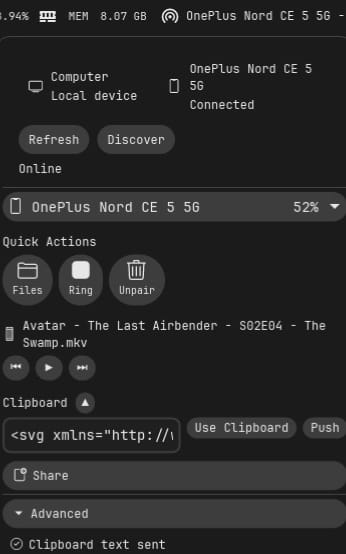
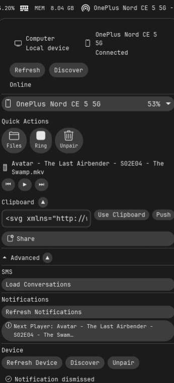
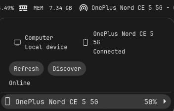

# cosmic-connect

A COSMIC desktop applet that wraps KDE Connect over D-Bus. Lets you control paired phones/tablets/laptops from the panel.

## Why

KDE Connect is usually launched as a separate app. This puts it in the panel as an always-available quick popup—useful if you frequently ping your phone, send files, or check battery status without opening a full window.

## What it does

- Lists paired and available devices
- Shows connection status and battery level  
- Sends ping/ring to locate devices
- Pushes/pulls clipboard text
- Shares files, URLs, and text snippets to device
- Browse device files over SFTP
- Accept/cancel/request pairing

All actions run through D-Bus to the KDE Connect daemon. No direct device connection; you still need KDE Connect running on both ends.

## SCREENSHOTS





## Building

```bash
cargo build --release
```

Requires:
- Rust 1.70+
- libcosmic (from pop-os/libcosmic)
- Linux with D-Bus
- wl-paste (for clipboard)

The applet discovers itself via the `.desktop` file and appears in the panel automatically after install.

## Testing the backend

```bash
cargo run --bin test_backend
```

Outputs device list. Useful for checking if KDE Connect is reachable over D-Bus.

## How it's structured

**Backend** (`src/backend/mod.rs`): Speaks D-Bus to `org.kde.kdeconnect`. Async calls for device list, actions, subscriptions.

**Model** (`src/model.rs`): Data shapes—`Device`, `DeviceType`, `ActionType`.

**App** (`src/app.rs`): Applet lifecycle. Renders popup UI, manages form state per-device (drafts), polls every 2s for device updates.

**Entry** (`src/main.rs`): Runs the COSMIC applet loop.

## Known issues

- File chooser requires libcosmic built with `cosmic::dialog` feature
- Wayland-only (uses wl-paste)
- No SMS/conversation UI yet

## Contributing

Bug reports and PRs welcome. Test against live D-Bus before submitting.
