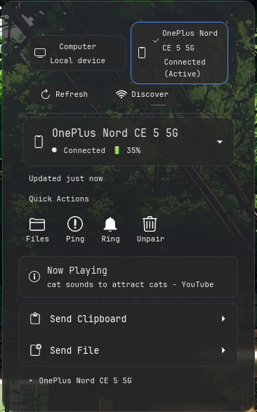

[](LICENSE)


# cosmic-connect

Plug KDE Connect into your COSMIC panel. Control your phone from one click.

If this saves you a click, star the repo.

## Screenshots

<table>
  <tr>
    <td><b>Applet in the panel</b></td>
    <td><b>Popup with device controls</b></td>
  </tr>
  <tr>
    <td><a href="screenshots/panel.jpeg"></a></td>
    <td><a href="screenshots/popup.jpeg"></a></td>
  </tr>
</table>

## What it does

- Lists paired devices, shows connection status and battery level
- Pings devices to locate them
- Pushes and pulls clipboard text
- Shares files, URLs, and text snippets
- Browses device files over SFTP
- Handles pairing requests

All actions go through D-Bus to the KDE Connect daemon. You still need KDE Connect running on both ends.

## Install

```bash
git clone https://github.com/AceMythos/cosmic-connect && cd cosmic-connect && make deps && make install
```

`make deps` installs system packages and Rust (first time only).
`make install` clones the patched KDE Connect fork, builds it,
installs it system-wide, builds the applet, and restarts the daemon.

Then add COSMIC Connect to your panel: COSMIC Settings -> Desktop -> Panel.

To verify the patched daemon:
```bash
pgrep -a kdeconnectd
```

## Requirements

- Rust 1.70+, libcosmic, D-Bus, wl-paste
- Build deps: `cmake extra-cmake-modules libkf5kio-dev libkf5notifications-dev libkf5dbusaddons-dev libkf5config-dev libkf5coreaddons-dev libkf5i18n-dev qtbase5-dev qttools5-dev`

<details>
<summary>Patched KDE Connect fork internals</summary>

The Makefile clones a [patched fork](https://github.com/AceMythos/kdeconnect-fork/tree/v23.08.5-patched) and installs it automatically. The patches add:

### Transfer progress D-Bus signals

KDE Connect's stock D-Bus interface only emits `shareReceived` when a transfer finishes. The patch adds four signals:

| Signal | Args |
|---|---|
| `transferStarted` | `transferId, fileName, totalBytes` |
| `transferProgress` | `transferId, bytesTransferred, totalBytes, percent` |
| `transferFinished` | `transferId, url` |
| `transferFailed` | `transferId, errorCode, errorString` |

### Native notification suppression

The fork blocks KDE Connect's own desktop notifications for file transfers and pairing requests. cosmic-connect handles those inline.

</details>

## Testing the backend

```bash
cargo run --bin test_backend
```

Outputs device list. Use it to check if KDE Connect is reachable over D-Bus.

## How it's structured

**Backend** (`src/backend/mod.rs`): D-Bus client for `org.kde.kdeconnect`. Async calls for device list, actions, subscriptions.

**Model** (`src/model.rs`): data shapes: `Device`, `DeviceType`, `ActionType`.

**App** (`src/app.rs`): applet lifecycle. Renders popup UI, manages form state per device, polls every 2s for device updates.

**Entry** (`src/main.rs`): runs the COSMIC applet loop.

## Comparison to other COSMIC KDE Connect applets

Several projects integrate KDE Connect with the COSMIC desktop. Here is how they approach the problem:

| Project | Approach | Depends on | Progress D-Bus signals | Notification suppression | SMS thread merging |
|---|---|---|---|---|---|
| **cosmic-connect** (this) | D-Bus wrapper | Patched KDE Connect fork (built-in) | ✅ | ✅ | ❌ |
| [cosmic-ext-connected](https://github.com/nwxnw/cosmic-ext-connected) | D-Bus wrapper | Stock KDE Connect daemon | ❌ | ❌ (documents dupes as known issue) | ✅ |
| [cosmic-utils/kdeconnect](https://github.com/cosmic-utils/kdeconnect) | Native Rust reimplementation | None (own daemon) | ❌ | N/A (no stock daemon) | ❌ |
| [olafkfreund/cosmic-ext-connect](https://github.com/olafkfreund/cosmic-ext-connect-desktop-app) | Native Rust + Android app | Own protocol (CConnect) | ❌ | N/A (own daemon) | ❌ |

cosmic-connect and cosmic-ext-connected both wrap the stock KDE Connect daemon over D-Bus. The main differences:

- **Patched daemon** cosmic-connect's [fork](#patched-kde-connect-fork) adds D-Bus signals for transfer progress and suppresses native notifications. cosmic-ext-connected documents "you may see duplicate notifications" as a known issue.
- **SMS merging** cosmic-ext-connected detects iOS reaction-over-SMS split threads and merges them automatically.

cosmic-utils/kdeconnect and olafkfreund/cosmic-ext-connect are full protocol reimplementations in Rust. They do not need the stock KDE Connect daemon. cosmic-connect is a 2k-line D-Bus client that wraps the proven KDE Connect C++ daemon.

## Known issues

- Transfer progress and native notification suppression require the [patched KDE Connect fork](#install) (built automatically by `make install`)
- File chooser requires libcosmic built with `cosmic::dialog` feature
- Wayland-only (uses wl-paste)
- No SMS/conversation UI yet

## Contributing

Bug reports and PRs welcome. Test against live D-Bus before submitting.
